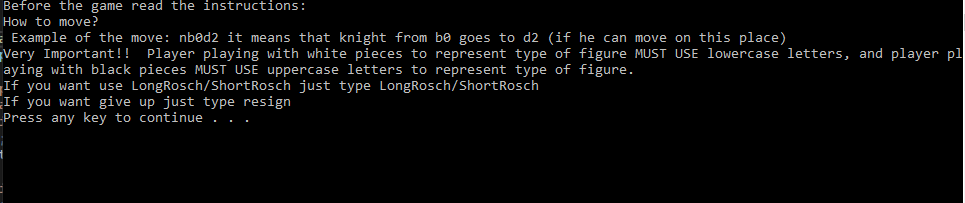
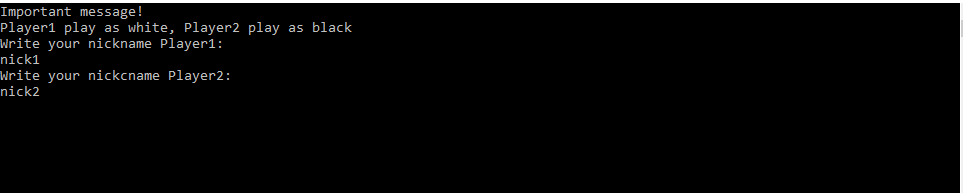
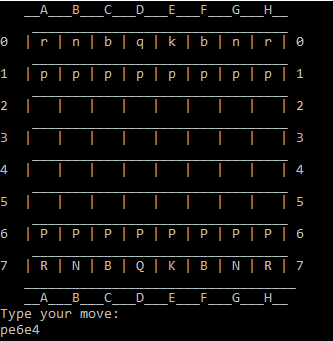

# Console Chess
It is console program that allows two players to play a game of chess. The program was written in C++ as a semestral project from the subject Computer Programing. In the project I used advance OOP techniques. Program menu is written in english.
## 🚀 About Me
I'm a student at Silesian Univeristy of Technology in Poland. I am studing Computer Science.
## Program Description

- Main menu:


At the beginning of the program, a brief instruction about the commands that can be used in chess is displayed (The current version of the game does not support en passant captures).


After pressing any button, a window is displayed where you can choose the players' nicknames.


Next, we move to the game board where the gameplay takes place. To make a move, you need to enter the following phrase: 
-Piece symbol (p/P - pawn, n/N - knight, b/B - bishop, r/R - rook, q/Q - queen, k/K - king)
-starting square of the piece
-ending square of the piece.
We move on the board using numbers from 0 to 7 for ranks and letters from a to h for files.

Example: pe6e4

White squares are marked with lowercase letters, and black squares are marked with uppercase letters.


## Run Locally

Clone the project

```bash
  https://github.com/PKraska02/My_Cpp_Projects
```

Go to the Release file

```bash
  run executable file ProjectChess.exe
```


## Tech Stack

**Languages:** C++
